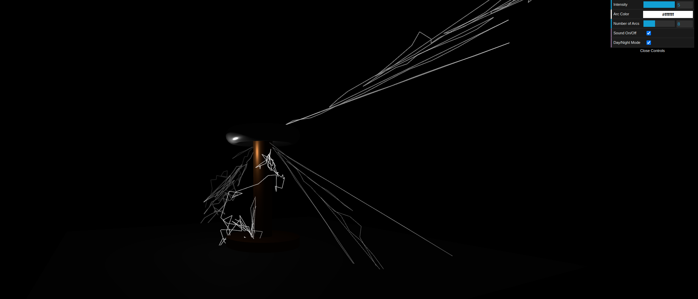

# Tesla Coil Simulator with Three.js

A 3D interactive Tesla coil simulator built using Three.js with configurable electrical arc effects.


*Simulation in Day Mode*


*Simulation in Night Mode*

## Features

- Realistic 3D model of a Tesla coil (primary coil, secondary coil, and toroid)
- Dynamic electrical arc simulation with physics-based behavior
- Interactive GUI controls for:
  - Intensity (affects arc length and frequency)
  - Arc color
  - Number of simultaneous arcs
  - Sound effects (on/off)
  - Day/Night mode to control panel
  - Advanced arc physics
- Smooth camera controls (orbit, zoom)
- Responsive design that adapts to window size

## How to Run

1. Make sure you have Python 3 installed
2. Clone this repository
3. Navigate to the project directory
4. Run the local server:
   ```bash
   python3 -m http.server 8000
   ```
5. Open http://localhost:8000 in your browser

## Controls

- Left-click + drag: Rotate view
- Right-click + drag: Pan view
- Scroll wheel: Zoom in/out
- GUI panel (top-right): Adjust simulation parameters

## Technical Details

- Built with Three.js r163
- Uses dat.GUI for parameter controls
- Arc simulation uses:
  - Randomized path generation
  - Time-based lifecycle management
  - Proper resource cleanup
- Responsive design using window resize events

## Future Enhancements

- Implement more advanced arc physics
- Add ground plane and spark effects
- Support for mobile/touch controls

## Donate and Support
 
If you find this project useful, please consider donating to support my open source projects. Thank you!

[](https://ko-fi.com/daliborjonic)

## License

GNU GENERAL PUBLIC LICENSE

Copyright (c) 2025 Dalibor Jonic

Permission is hereby granted, free of charge, to any person obtaining